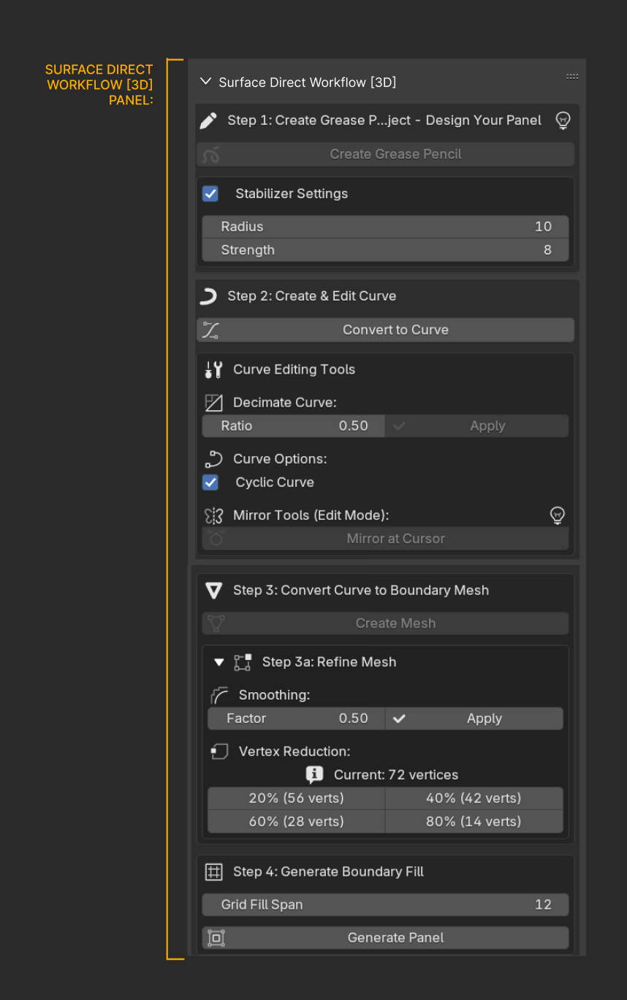
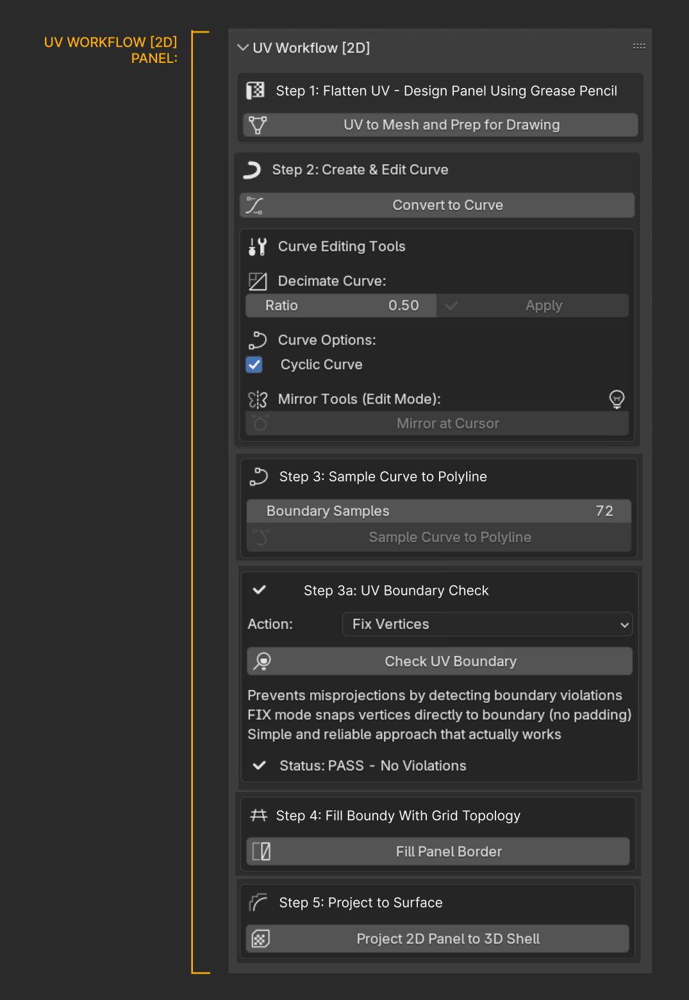
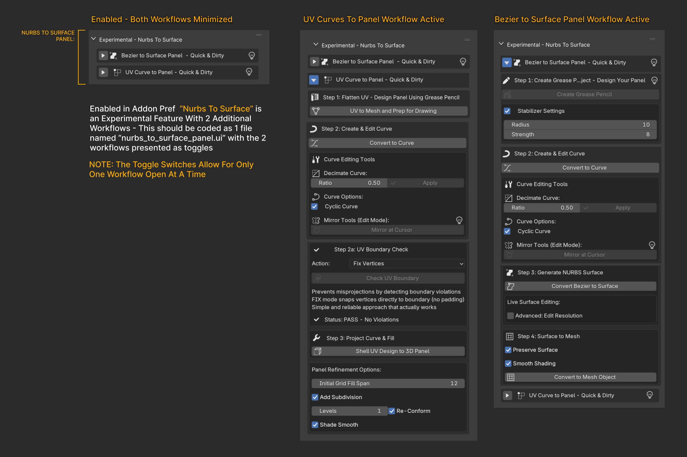

# UI v2 Layout — Sneaker Panel Pro

This folder contains the visual reference and a machine-readable map for wiring the new UI without touching operator logic.

## Reference Images (from Figma)

> If these filenames differ, update the links below to match your exports.

### Main Panel (Toolbar, Lace, Auto UV)


### Surface Direct [3D]


### UV Workflow [2D]


### Experimental — Nurbs to Surface (Q&D)


---

## Operator Placement Map

Codex: **do not** change any operator logic or rename any `bl_idname`.  
Use this table to relocate existing `layout.operator("<id>")` calls into the new panels/sections.

See: [`operator_map.csv`](./operator_map.csv)

- Columns:
  - **op_id** — the exact operator `bl_idname` that already exists
  - **panel** — target panel title (as rendered in Blender)
  - **section** — target group/step inside that panel (match image labeling)

---

## Gating & State (for reference)

- Workflow radio (Window Manager):
  - `window_manager.spp_active_workflow` → `'SURFACE_3D' | 'UV_2D'`
- Independent toggles (Window Manager):
  - `window_manager.spp_show_auto_uv` → shows Auto UV panel
  - `window_manager.spp_show_lace_gen` → shows Lace Generator panel
- Experimental (Addon Preferences):
  - `enable_experimental_qd` → shows Experimental panel
  - Internal radio: `scene.spp_nurbs_qd_active` → `'QD_BEZIER' | 'QD_UV_CURVE'`

Panels already implement `poll()` based on the above. **Do not** add extra gating.

---

## Validation

1. Run the operator checker and ensure no operator IDs changed:
   ```bash
   python tools/ui_refactor_check.py --after
